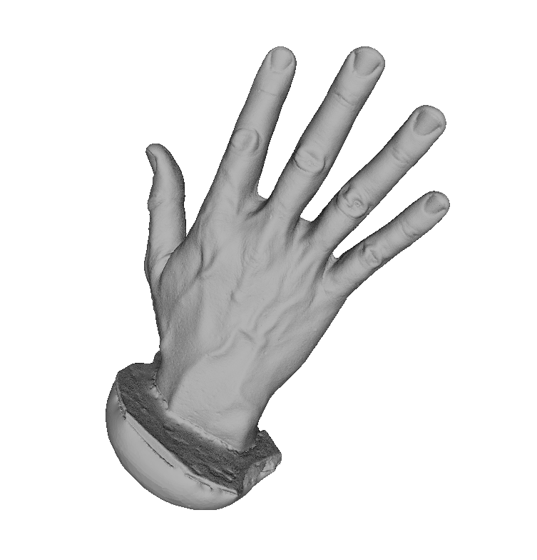

Abe Hand
---

All 3d models in this directory, `AbeHand`, are licensed under [CC0](https://creativecommons.org/publicdomain/zero/1.0/).  Please use them without restriction.

Scans were done via a [structured light David Scanner](http://www8.hp.com/us/en/campaign/3Dscanner/overview.html) from a plaster cast of a dental algenate mold of my right hand.  The model had an air bubble in the index finger.  The plaster cast picked up some fingerprint detail but the David scanner was not calibrated well enough to be able to see it.

The directory `altered_scans` are the cleaned and aligned scans used for the aligned models (`Fusion01.obj`, I believe).

Here is a screenshot of the model in meshlab:

The units should be in metric, where one unit represents 1mm.

Original scans are provided along with the aligned and decimated versions of the model.
