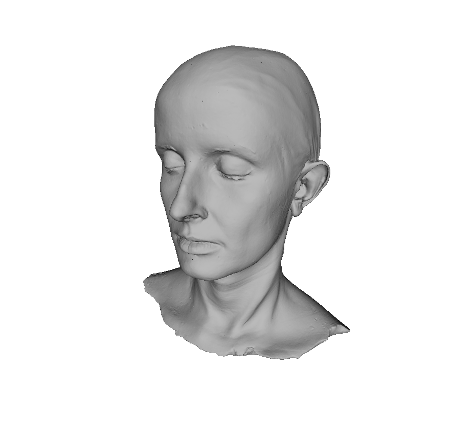

Lydia Ash
---

All 3d models in this directory, `LydiaAsh`, are licensed under [CC0](https://creativecommons.org/publicdomain/zero/1.0/).  Please use them without restriction.

Scans were done via a [structured light David Scanner](http://www8.hp.com/us/en/campaign/3Dscanner/overview.html) from a plaster cast.

Original scans are too large for GitHub and only decimated scans are provided.
There is a copy of all scans on [archive.org/details/lydiaash2000.obj](https://archive.org/details/lydiaash2000.obj).
